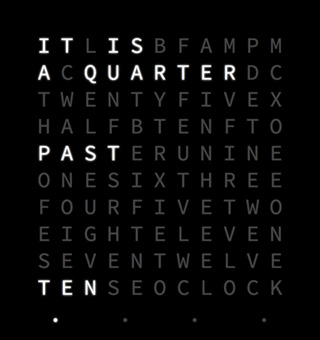

# Web-based word qlock using:

* [Ractive](http://www.ractivejs.org/)
* [ES6 (via BabelJS)](http://babeljs.io/)
* [Webpack](http://webpack.github.io)
* [Animate.css](https://daneden.github.io/animate.css/)

----

## Install & Run:

### Development:

    npm install
    node app.js
    open http://localhost:3000

### Production:

    npm install
    webpack -p
    Host index.html and bundle.js wherever you want.
